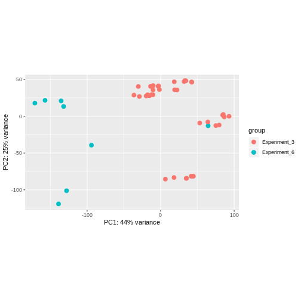
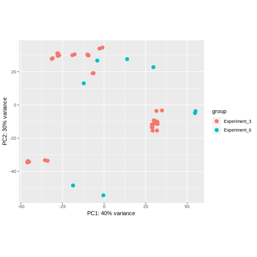

**Contents**


```r
library(tidyverse) 
```

```
## ── Attaching packages ────────────────────────────────── tidyverse 1.2.1 ──
```

```
## ✔ ggplot2 3.1.0     ✔ purrr   0.2.5
## ✔ tibble  1.4.2     ✔ dplyr   0.7.8
## ✔ tidyr   0.8.2     ✔ stringr 1.3.1
## ✔ readr   1.2.1     ✔ forcats 0.3.0
```

```
## ── Conflicts ───────────────────────────────────── tidyverse_conflicts() ──
## ✖ dplyr::filter() masks stats::filter()
## ✖ dplyr::lag()    masks stats::lag()
```

```r
library(DESeq2)
```

```
## Loading required package: S4Vectors
```

```
## Loading required package: stats4
```

```
## Loading required package: BiocGenerics
```

```
## Loading required package: parallel
```

```
## 
## Attaching package: 'BiocGenerics'
```

```
## The following objects are masked from 'package:parallel':
## 
##     clusterApply, clusterApplyLB, clusterCall, clusterEvalQ,
##     clusterExport, clusterMap, parApply, parCapply, parLapply,
##     parLapplyLB, parRapply, parSapply, parSapplyLB
```

```
## The following objects are masked from 'package:dplyr':
## 
##     combine, intersect, setdiff, union
```

```
## The following objects are masked from 'package:stats':
## 
##     IQR, mad, sd, var, xtabs
```

```
## The following objects are masked from 'package:base':
## 
##     anyDuplicated, append, as.data.frame, basename, cbind,
##     colMeans, colnames, colSums, dirname, do.call, duplicated,
##     eval, evalq, Filter, Find, get, grep, grepl, intersect,
##     is.unsorted, lapply, lengths, Map, mapply, match, mget, order,
##     paste, pmax, pmax.int, pmin, pmin.int, Position, rank, rbind,
##     Reduce, rowMeans, rownames, rowSums, sapply, setdiff, sort,
##     table, tapply, union, unique, unsplit, which, which.max,
##     which.min
```

```
## 
## Attaching package: 'S4Vectors'
```

```
## The following objects are masked from 'package:dplyr':
## 
##     first, rename
```

```
## The following object is masked from 'package:tidyr':
## 
##     expand
```

```
## The following object is masked from 'package:base':
## 
##     expand.grid
```

```
## Loading required package: IRanges
```

```
## 
## Attaching package: 'IRanges'
```

```
## The following objects are masked from 'package:dplyr':
## 
##     collapse, desc, slice
```

```
## The following object is masked from 'package:purrr':
## 
##     reduce
```

```
## Loading required package: GenomicRanges
```

```
## Loading required package: GenomeInfoDb
```

```
## Loading required package: SummarizedExperiment
```

```
## Loading required package: Biobase
```

```
## Welcome to Bioconductor
## 
##     Vignettes contain introductory material; view with
##     'browseVignettes()'. To cite Bioconductor, see
##     'citation("Biobase")', and for packages 'citation("pkgname")'.
```

```
## Loading required package: DelayedArray
```

```
## Loading required package: matrixStats
```

```
## 
## Attaching package: 'matrixStats'
```

```
## The following objects are masked from 'package:Biobase':
## 
##     anyMissing, rowMedians
```

```
## The following object is masked from 'package:dplyr':
## 
##     count
```

```
## Loading required package: BiocParallel
```

```
## 
## Attaching package: 'DelayedArray'
```

```
## The following objects are masked from 'package:matrixStats':
## 
##     colMaxs, colMins, colRanges, rowMaxs, rowMins, rowRanges
```

```
## The following object is masked from 'package:purrr':
## 
##     simplify
```

```
## The following objects are masked from 'package:base':
## 
##     aperm, apply
```

```r
mycounts <- read_csv("/home/jibin/Documents/Python_Tutorials/Assignment/Exp6_Exp3_Counts_Test.csv") 
```

```
## Parsed with column specification:
## cols(
##   .default = col_double(),
##   Gene = col_character()
## )
```

```
## See spec(...) for full column specifications.
```

```r
metadata <-  read_csv("/home/jibin/Documents/Python_Tutorials/Assignment/Exp6_Exp3_Counts_Test_Metadata.csv") 
```

```
## Parsed with column specification:
## cols(
##   RowNames = col_character(),
##   Samples = col_character(),
##   Sample_Filenames = col_character(),
##   Number = col_double(),
##   Sample_ID = col_character(),
##   Randomized_Sample_Name = col_character(),
##   Plate = col_double(),
##   SeqMatic_Run = col_double(),
##   Date_of_SeqMatic_Run = col_character(),
##   Experiment = col_character(),
##   Donor = col_character(),
##   Knockdown = col_character(),
##   Time = col_double(),
##   ReActivation = col_character(),
##   Remarks = col_character(),
##   Knockdown_Donor = col_character(),
##   Replicate = col_double(),
##   Cohort = col_character()
## )
```

```r
mycounts <- as.data.frame(mycounts)

metadata <- as.data.frame(metadata)

names(mycounts)[-1]==metadata$RowNames
```

```
##  [1] TRUE TRUE TRUE TRUE TRUE TRUE TRUE TRUE TRUE TRUE TRUE TRUE TRUE TRUE
## [15] TRUE TRUE TRUE TRUE TRUE TRUE TRUE TRUE TRUE TRUE TRUE TRUE TRUE TRUE
## [29] TRUE TRUE TRUE TRUE TRUE TRUE TRUE TRUE TRUE TRUE TRUE TRUE TRUE TRUE
## [43] TRUE TRUE TRUE TRUE TRUE TRUE
```

```r
all(names(mycounts)[-1]==metadata$RowNames)
```

```
## [1] TRUE
```

```r
dds <- DESeqDataSetFromMatrix(countData=mycounts, 
                              colData=metadata, 
                              design=~ Experiment, 
                              tidy=TRUE)
```

```
## converting counts to integer mode
```

```
## Warning in DESeqDataSet(se, design = design, ignoreRank): some variables in
## design formula are characters, converting to factors
```

```r
dds <- DESeq(dds)
```

```
## estimating size factors
```

```
## estimating dispersions
```

```
## gene-wise dispersion estimates
```

```
## mean-dispersion relationship
```

```
## -- note: fitType='parametric', but the dispersion trend was not well captured by the
##    function: y = a/x + b, and a local regression fit was automatically substituted.
##    specify fitType='local' or 'mean' to avoid this message next time.
```

```
## final dispersion estimates
```

```
## fitting model and testing
```

```
## -- replacing outliers and refitting for 175 genes
## -- DESeq argument 'minReplicatesForReplace' = 7 
## -- original counts are preserved in counts(dds)
```

```
## estimating dispersions
```

```
## fitting model and testing
```

```r
res <- results(dds, tidy=TRUE)


vsdata <- vst(dds, blind=FALSE)


plotPCA(vsdata, intgroup="Experiment", ntop=5000)
```



```r
dev.copy(jpeg,filename="Top_5000.jpg");
```

```
## jpeg 
##    3
```

```r
 dev.off ()
```

```
## png 
##   2
```

```r
plotPCA(vsdata, intgroup="Experiment", ntop=500)
```



```r
dev.copy(jpeg,filename="Top_500.jpg");
```

```
## jpeg 
##    3
```

```r
 dev.off ()
```

```
## png 
##   2
```